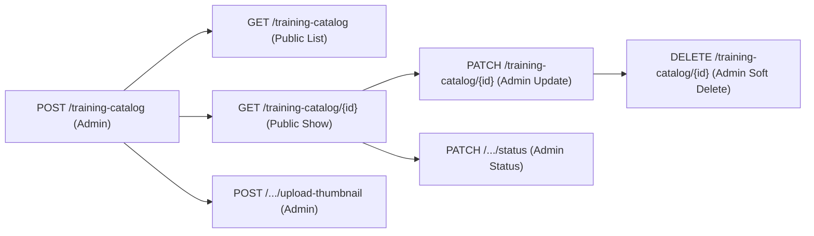
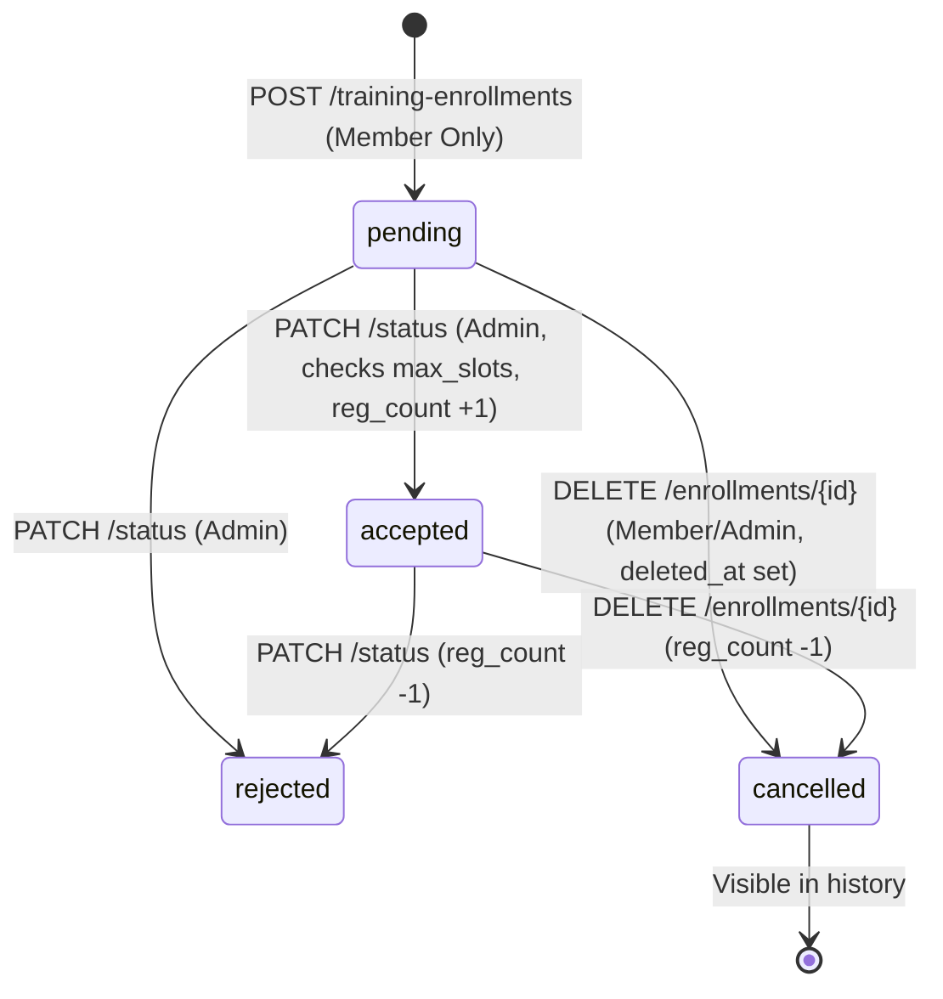

# Code Review: Pull Request #9 (`refactor/training`)

**Repository:** `tnnz20/youthpreneur-be`  
**PR Link:** [https://github.com/tnnz20/youthpreneur-be/pull/9](https://github.com/tnnz20/youthpreneur-be/pull/9)  
**Branch:** `refactor/training` $\rightarrow$ `master`  
**Date:** September 24, 2026  
**Status:** **READY TO MERGE** (with minor non-blocking polish recommendations)

---

## 1. Executive Summary

Pull Request #9 refactors the **Training Catalog** and **Training Enrollment** domains to align with the revised product specifications:
1. **Catalog Domain:** Renames legacy fields (`name` $\rightarrow$ `title`, `speaker` $\rightarrow$ `mentor`, `training_slots` $\rightarrow$ `max_slots`), converts categories into a strict PostgreSQL enum (`training_category_enum`), introduces calendar date ranges (`start_date`, `end_date`), adds a physical `registered_count` column, and provides secure thumbnail upload (`/uploads/thumbnails/`).
2. **Enrollment Domain:** Implements the full lifecycle approval state machine (`pending`, `accepted`, `rejected`, `cancelled`), restricts enrollment creation strictly to the `member` role, maintains historical records across cancellations while preserving re-enrollment capabilities, and ensures transactional seat reservation.
3. **Tooling & Docs:** Adds a CSV catalog seeder (`cmd/seed-catalog`), updates migration scripts (`000008`), and keeps `AGENTS.md` and `api/api-contract.md` strictly synchronized.

All unit, usecase, and repository integration tests pass at 100% (`go test -count=1 ./...`, `go vet ./...`, `git diff --check`).

---

## 2. Comprehensive Flow Verification

### A. Training Catalog Lifecycle



| Action | Route & Method | Auth / Scope | Key Logic & Verification | Status |
| :--- | :--- | :--- | :--- | :--- |
| **Create** | `POST /training-catalog` | Admin only | Validates `title` ($\le 255$), valid `category` enum, positive `max_slots`, `end_date >= start_date`, link scheme `http`/`https`. Generates `TCY-[0-9]{6}`. Returns `201 Created`. | **Pass** |
| **Show (One)** | `GET /training-catalog/{publicID}` | Public | Looks up `c.public_id = $1 AND c.deleted_at IS NULL`. Returns `200 OK` with full catalog summary. If deleted/absent: `404 Not Found`. | **Pass** |
| **Show (List)** | `GET /training-catalog` | Public | Supports filters: `search`/`q` (against `title` and `mentor`), `title`, `mentor`, `category`, `training_status`, `start_date`, `order` (`asc`/`desc`). Cursor pagination with `limit + 1`. Returns `200 OK`. | **Pass** |
| **Update** | `PATCH /training-catalog/{publicID}` | Admin only | Locks row via `SELECT ... FOR UPDATE`. Merges only supplied fields. Re-validates merged date range (`end_date >= start_date`). Returns `200 OK` from `RETURNING`. | **Pass** |
| **Update Status** | `PATCH /training-catalog/{publicID}/status` | Admin only | Validates status against `ProcessStatus` (`planned`, `ongoing`, `completed`). Updates `training_status` and `updated_at`. Returns `200 OK`. | **Pass** |
| **Upload Thumbnail**| `POST /training-catalog/upload-thumbnail` | Admin only | Multipart form (`thumbnail`). Rejects files $> 5$ MiB. Sniffs first 512 bytes for MIME type (`image/png`, `image/jpeg`). Writes with random filename. Returns `201 Created` with `/uploads/thumbnails/...`. Statically served via `GET /uploads/*` with directory indexing blocked (`noDirFileSystem`). | **Pass** |
| **Delete** | `DELETE /training-catalog/{publicID}` | Admin only | Soft deletes: `SET deleted_at = now, updated_at = now WHERE public_id = $1 AND deleted_at IS NULL`. Returns `204 No Content`. Subsequent reads return `404`. | **Pass** |

---

### B. Training Enrollment Lifecycle



| Action | Route & Method | Auth / Scope | Key Logic & Verification | Status |
| :--- | :--- | :--- | :--- | :--- |
| **Create** | `POST /training-enrollments` | Authenticated; **Member only** | Non-members receive `400 Bad Request`. Locks catalog with `FOR UPDATE`. Rejects if catalog is not `planned`/`ongoing` (`409`). Checks active duplicate (`WHERE deleted_at IS NULL`) $\rightarrow$ `409`. Checks capacity (`WHERE deleted_at IS NULL AND status NOT IN ('rejected', 'cancelled')`) $\rightarrow$ `409` if full. Inserts `status = 'pending'`, `register_date = today`. Generates `ENR-[0-9]{6}`. Returns `201 Created`. | **Pass** |
| **Show (Mine)** | `GET /training-enrollments/my` | Authenticated; Current user only | Scoped to `actor.ID`. Joins `user_profiles.full_name` and slim catalog summary. Includes cancelled enrollments so history survives. Supports `status` (`pending`, `accepted`, `rejected`, `cancelled`) and `search` filters. | **Pass** |
| **Show (All)** | `GET /training-enrollments` | Admin only | Unscoped list across all users. Supports `status` and `search` (participant name). Cursor-paginated. | **Pass** |
| **Show (Catalog)** | `GET /training-enrollments/catalog/{catalogPublicID}` | Admin only | Scoped to catalog offering. Returns full participant history for that training. | **Pass** |
| **Update Status** | `PATCH /training-enrollments/{publicID}/status` | Admin only | Locks both catalog and enrollment (`FOR UPDATE OF c, e`). If transitioning to `accepted`, verifies `registered_count < max_slots` and increments `registered_count`. If transitioning away from `accepted`, decrements `registered_count`. If updated to `cancelled`, sets `deleted_at = updatedAt`. | **Pass** |
| **Cancel (Delete)**| `DELETE /training-enrollments/{publicID}` | Authenticated; Owner or Admin | Scoped to owner (`WHERE user_id = actor.ID`) or unscoped for admins. Locks enrollment row. Sets `status = 'cancelled'`, `deleted_at = now`, `updated_at = now`. If previous status was `accepted`, decrements `registered_count`. Returns `204 No Content`. | **Pass** |

---

## 3. Bug & Edge Case Findings

### 1. Re-Enrollment Flow After Cancellation vs Rejection
- **Cancellation (`status = 'cancelled'`):** `CancelTrainingEnrollment` and `UpdateTrainingEnrollmentStatus` set `deleted_at = timestamp`. 
  - The partial unique constraint is:
    ```sql
    CREATE UNIQUE INDEX training_enrollments_active_unique 
        ON training_enrollments (training_catalog_id, user_id) WHERE deleted_at IS NULL;
    ```
  - Because `deleted_at IS NOT NULL`, the unique index allows the user to re-enroll in the future.
  - The duplicate check query (`WHERE training_catalog_id = $1 AND user_id = $2 AND deleted_at IS NULL`) ignores it. **Re-enrollment works as intended.**
- **Rejection (`status = 'rejected'`):** When an admin rejects an application, `deleted_at` remains `NULL`.
  - The duplicate check `WHERE user_id = $2 AND deleted_at IS NULL` will find this row and prevent the user from re-applying.
  - **Verdict:** This is correct business logic (an application rejected by an administrator should not be immediately re-submittable by the user unless cancelled or cleared), but team members should note that rejection intentionally locks out re-application.

### 2. Concurrency & Race-Condition Safety
- `CreateTrainingEnrollment`: Uses `SELECT ... FROM training_catalog WHERE public_id = $1 AND deleted_at IS NULL FOR UPDATE` to serialize capacity checking and insertion.
- `UpdateTrainingEnrollmentStatus`: Uses `FOR UPDATE OF c, e` to lock both the catalog and enrollment rows simultaneously.
- `CancelTrainingEnrollment`: Uses `SELECT ... FROM training_enrollments ... FOR UPDATE` before updating status and decrementing catalog registered count.
- **Verdict:** Free of race conditions, lost updates, or overselling capacity.

### 3. Case Insensitivity & Alias Normalization
- `normalizeEnrollmentStatus` converts query strings to lowercase and maps `"canceled"` $\rightarrow$ `"cancelled"`.
- Clients sending either single-l or double-l spelling will succeed without errors.

---

## 4. Code Hygiene, Duplication & Dead Code Analysis

### A. Harmless Redundant Assignment (Minor)
In [`internal/repository/persistence/training_catalog_postgres.go:228`](file:///c:/Users/tnnz/Documents/projects/freelancer/youthpreneur-be/internal/repository/persistence/training_catalog_postgres.go#L228):
```go
updated, err := scanTrainingCatalog(tx.QueryRowContext(ctx, `
    UPDATE training_catalog c
    SET ...
    WHERE c.public_id = $1 AND c.deleted_at IS NULL
    RETURNING `+trainingCatalogColumns,
    ...
).Scan)
...
updated.RegisteredCount = locked.RegisteredCount // <--- Redundant
```
- **Analysis:** `trainingCatalogColumns` already includes `c.registered_count`, and `scanTrainingCatalog` already maps `row.registeredCount` into `updated.RegisteredCount`.
- **Impact:** None (both values are identical). It can be left as-is or cleaned up in a future polish commit.

### B. Unused Code & Struct Audit
- **Models & Requests:** Every request struct (`CreateTrainingCatalogRequest`, `UpdateTrainingCatalogRequest`, `CreateTrainingEnrollmentRequest`, `UpdateTrainingEnrollmentStatusRequest`, etc.) is wired directly into HTTP handlers.
- **Converters:** `ToTrainingCatalogResponse`, `ToTrainingCatalogResponses`, `ToTrainingEnrollmentResponse`, and `ToTrainingEnrollmentResponses` are all used by handler responses. Handlers define zero local converters, adhering strictly to `AGENTS.md`.
- **Database Types:** Enums `training_category_enum` and `training_enrollment_status_enum` match their Go entity definitions and converters.

---

## 5. Architectural & Standards Compliance

| Criterion | Requirement (AGENTS.md) | Assessment |
| :--- | :--- | :--- |
| **Layering** | `route` $\rightarrow$ `handler` $\rightarrow$ `usecase` $\rightarrow$ `repository` | **Compliant** |
| **Data Types** | Epoch seconds in `BIGINT`, dates `YYYY-MM-DD` | **Compliant** |
| **Public IDs** | `TCY-` + 6 digits (catalogs), `ENR-` + 6 digits (enrollments) | **Compliant** |
| **Role Restriction** | `POST /training-enrollments` requires `member` role | **Compliant** |
| **Soft Delete** | Preserve rows with `deleted_at`; preserve history in queries | **Compliant** |
| **Static Serving** | Uploaded assets under `/uploads/thumbnails/` without directory indexing | **Compliant** (`noDirFileSystem`) |
| **Documentation** | Contract docs aligned with routes, request/response models, and DB | **Compliant** (`api/api-contract.md`) |

---

## 6. Recommendations & Actionable Suggestions

1. **(Resolved)** Removed the redundant `updated.RegisteredCount = locked.RegisteredCount` line in `training_catalog_postgres.go`.
2. **(Observation)** If the product team ever desires that rejected participants be allowed to re-apply to the same training catalog, the rejection flow could set `deleted_at = now` (similar to cancellation). As implemented today, rejected users remain barred from re-applying, which is typically the desired administrative behavior.

---

## 7. Conclusion & Merge Recommendation

**Verdict: READY TO MERGE.**

The code is clean, idiomatic, fully tested, and meets all behavioral, security, and architectural invariants specified in `AGENTS.md` and `api/api-contract.md`. No blocking bugs, leaks, or regressions were detected.
